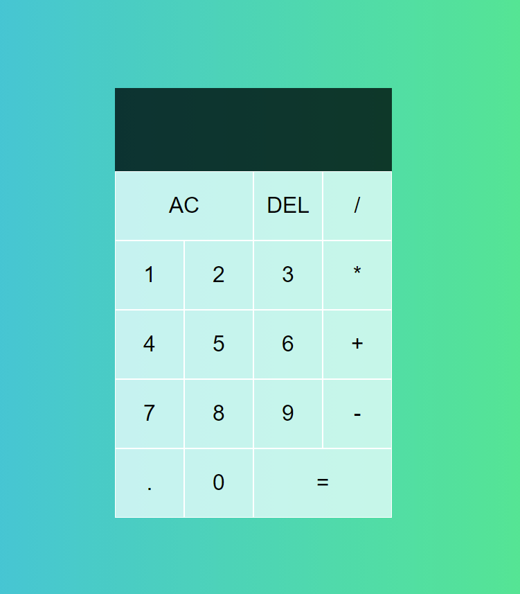

# DTS 2021 - JUNIOR WEB DEV - TASK 8 

# Simple-Calculator
 Simple calculator app using php for calculations, js dom, and xmlHttpRequest to access functions in php 

 ## User Interface
 

 ### Example : 
 - (+)

- (*)

